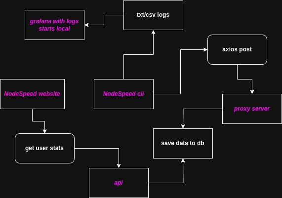

# NodeSpeed - [Status page](https://node-speed-proxy.onrender.com/)

A typing speed test that lives in your terminal — pick a language and a
difficulty, race against the clock, or challenge someone else to a live 1v1
duel with nothing but a room code.



## Features

- **Three languages** — English, Russian, Ukrainian source texts
- **Three difficulty levels** — from warm-up paragraphs to dense text
- **Normal or timed mode** — no clock, or a hard time limit
- **Bring your own text** — a local file, a URL, or the built-in random set
- **Local + global stats** — every attempt is logged locally and synced to
  your account
- **Online duels** — quick-match a random opponent or race a friend with a
  private room code, over Socket.IO

## Installation

**Prebuilt binaries** (recommended) — grab the latest release for your OS
from the [Releases page](https://github.com/fxhxyz4/NodeSpeed/releases/latest):

```sh
./NodeSpeed-linux     # Linux
./NodeSpeed-mac        # macOS
NodeSpeed-win.exe       # Windows
```

**From source** — see [`CONTRIBUTING.md`](./CONTRIBUTING.md#nodespeed-cli)
for the full build steps (you'll need Node.js and, on Linux, Wine if you
want to cross-build the Windows binary).

Either way, rename `src/env/.env.example` to `.env` and fill in your own
values before first run.

## Usage

```sh
nodespeed [flags]
```

| Flag                 | Argument             | Default   | Description                              |
| --------------------- | --------------------- | ---------- | ----------------------------------------- |
| `-h`, `--help`         | —                       | —          | Basic help                                 |
| `--helpCmd`            | `<command name>`       | —          | Show detailed info for one command          |
| `-a`, `--about`        | —                       | —          | About NodeSpeed                            |
| `-v`, `--version`       | —                       | —          | Current version                            |
| `--contact`             | —                       | —          | Contact credentials                        |
| `-c`, `--complexity`    | `<level>`               | `2`        | Difficulty: `1`, `2`, or `3`                |
| `-l`, `--lang`           | `<language>`            | `en`       | `en`, `ua`, or `ru`                        |
| `-m`, `--mode`           | `<mode>`                 | `normal`  | `normal` or `timed`                        |
| `-t`, `--time`           | `<seconds>`              | `300`      | Time limit, `timed` mode only               |
| `-s`, `--source`         | `<file\|url\|random>`    | `random`  | Where the text comes from                    |
| `--stats`               | —                       | —          | Local + global typing stats                  |
| `-o`, `--online`         | —                       | —          | Find or create an online duel                 |

Run `nodespeed --helpCmd=<command>` for the full description and an example
of any single flag.

### Examples

```sh
nodespeed -c=3 -l=ru -m=timed -t=120     # hard, Russian, 2-minute race
nodespeed -s=./my-text.txt                # type your own file
nodespeed --stats                          # see your progress
nodespeed -o                                # race someone online
```

### Online duels

Running `nodespeed -o` gives you three choices: quick match against a
random opponent, create a private room, or join one with a code. Creating a
room hands you a short code (e.g. `7F3K9Q`) — send it to whoever you want to
race, they run `nodespeed -o` and choose "join". Both terminals get the same
text at the same moment; fastest and most accurate typist wins.

## Project layout

This repository holds more than just the CLI:

| Path       | What it is                                        |
| ---------- | --------------------------------------------------- |
| `src/`     | The CLI (this is what gets built into a binary)      |
| `proxy/`   | Server the CLI talks to for stats + online duels      |
| `db/`      | MySQL schema used by the proxy                         |
| `www/`     | Landing page — deployed via GitHub Pages, `npm run deploy` |
| `uptime/`  | Status page for the proxy                                |

See [`CONTRIBUTING.md`](./CONTRIBUTING.md) for how to set up and run each of
these.

## Running the backend

`proxy`, `db`, and `uptime` are containerized:

```sh
cp .env.example .env   # fill in DB creds, session secret, ports
docker compose up -d --build
```

`www` isn't part of Docker — it's a static site published to GitHub Pages
at [fxhxyz4.github.io/nodespeed](https://fxhxyz4.github.io/nodespeed/).
See [`CONTRIBUTING.md`](./CONTRIBUTING.md#website-www) for how to redeploy it.

## Contributing

Bug reports, feature requests, and PRs are welcome — read
[`CONTRIBUTING.md`](./CONTRIBUTING.md) first for code style and commit
conventions, and [`code_of_conduct.md`](./code_of_conduct.md) for how we
expect people to treat each other.

## Security

Found a vulnerability? Please report it privately per
[`security.md`](./security.md) rather than opening a public issue.

## License

NodeSpeed is released under a custom **NOT MIT** license — free for personal
and educational use only. See [`license.md`](./license.md)
([Русский](./license.ru.md) / [Українська](./license.ua.md)).

## Contact

- [fxhsec@proton.me](mailto:fxhsec@proton.me)
- [fxhxyz.vercel.app](https://fxhxyz.vercel.app)